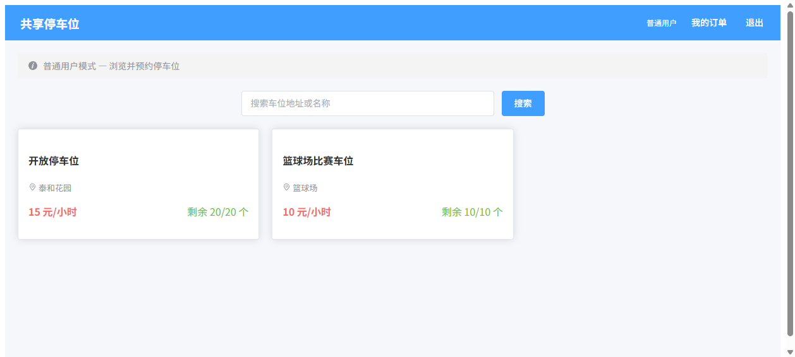
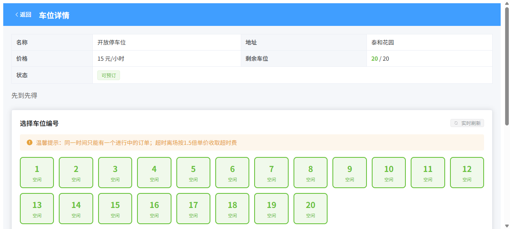
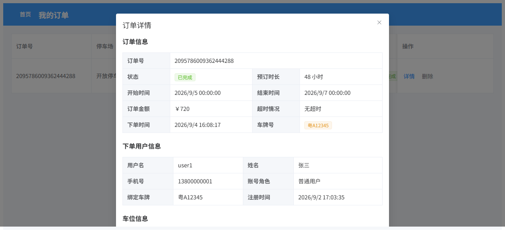

# 共享停车位系统

[](https://github.com/your-username/parking-system/actions/workflows/ci.yml)

> ⚠️ 提交到 GitHub 后，请将上述徽章中的 `your-username` 替换为你自己的仓库所有者；CI 工作流见 `.github/workflows/ci.yml`（拉取代码后自动跑 `mvn package`）。

基于 Spring Cloud Alibaba 微服务架构的共享停车位预订平台，实现用户注册登录、车位发布与搜索、订单管理、模拟支付等完整业务闭环。

## 技术栈

| 层面 | 技术 |
|------|------|
| 微服务框架 | Spring Boot 3.2 + Spring Cloud 2023 + Spring Cloud Alibaba 2023 |
| 注册中心 | Nacos 3.x |
| API 网关 | Spring Cloud Gateway（JWT 统一鉴权） |
| 服务调用 | OpenFeign + LoadBalancer |
| 分布式锁 | Redisson（Redis 分布式锁，防止并发抢单） |
| 熔断降级 | Resilience4j（Feign 熔断器 + Fallback 降级） |
| 数据库 | MySQL 8.0（每服务独立数据库） |
| ORM | MyBatis-Plus 3.5（乐观锁 @Version） |
| 认证 | JWT + BCrypt |
| 接口文档 | Knife4j (Swagger) |
| 前端 | Vue 3 + Element Plus + Vite |
| 工具库 | Hutool |
| JDK | 17 |

## 项目结构

```
parking-system/
├── parking-common/          # 公共模块（Result 封装、JWT 工具、全局异常处理）
├── gateway-service/  :8080  # API 网关（路由分发、JWT 鉴权、文档聚合）
├── user-service/     :8081  # 用户服务（注册、登录、角色管理）
├── parking-service/  :8082  # 车位服务（发布、搜索、管理）
├── order-service/    :8085  # 订单服务（预订、取消、完成、删除，Feign 调用 parking/payment）
├── payment-service/  :8084  # 支付服务（模拟支付）
├── parking-web/      :5173  # Vue 3 前端
├── sql/                     # 数据库初始化脚本
├── scripts/                 # 运维脚本（start-ha.sh / stop-ha.ps1）
└── nginx/                   # 网关高可用 VIP 配置（nginx.conf）
```

## 架构图

```
                    ┌───────────┐
                    │  Nacos    │
                    │  :8848    │
                    └─────┬─────┘
                          │ 服务注册/发现
              ┌───────────┼───────────┐
              │           │           │
     ┌────────▼───┐ ┌─────▼────┐ ┌───▼──────┐
     │  Gateway   │ │  User    │ │ Parking  │
     │  :8080     │ │  :8081   │ │ :8082    │
     │ JWT 鉴权   │ └─────┬────┘ └───┬──────┘
     └─────┬──────┘       │          │
           │         ┌────▼────┐ ┌───▼──────┐
           │         │  Order  │ │ Payment  │
           │         │  :8085  │ │ :8084    │
           │         │ ┌──┬──┐ │ └──────────┘
           │         │ │Feign│ │     ▲
           │         │ └──┬└──┘ │     │ Feign(熔断降级)
           │         │    │     └─────┘
           │         │ ┌──▼──────┐
           │         │ │  Redis  │ 分布式锁+幂等
           │         │ │  :6379  │
           │         │ └─────────┘
     ┌─────▼─────┐
     │ Vue3 前端  │
     │  :5173    │
     └───────────┘
```

## 项目展示

| 首页 / 车位列表 | 车位详情（可视化选位） | 订单详情（含支付信息） |
|:---:|:---:|:---:|
|  |  |  |

## 核心功能

### 用户体系
- **注册绑定车牌**：用户注册时必须填写车牌号，一人一车一牌
- **角色区分**：普通用户（USER）可浏览预订车位，业主（OWNER）可发布管理车位
- **JWT 鉴权**：网关统一校验 token，转发 X-User-Id / X-User-Role 给下游服务

### 车位管理
- 业主发布车位（名称、地址、单价、总车位数），发布时自动生成 N 个独立车位明细（编号 1~N）
- 车位列表搜索（按名称/地址关键词）
- 独立车位原子占用/释放（DB UPDATE WHERE status='AVAILABLE'，防超卖）
- 前端可视化车位网格（空闲/已占/已选），5 秒自动刷新状态

### 订单业务
- **一人一单**：同一用户同时只能有一个进行中的订单（RESERVED / USING），防止恶意占位
- **用户选位**：用户在车位详情页可视化选择空闲车位编号（1-N），已被占用的车位不可选
- **高并发防超卖**（三层并发控制）：
  - Layer 1: Redis SETNX 幂等性检查（5s 防重复提交）
  - Layer 2: Redisson 分布式锁 `lock:spot:{spaceId}:{spotNumber}`（等待5s，持有10s）
  - Layer 3: 数据库原子 UPDATE `WHERE status='AVAILABLE'`（InnoDB 行级锁，最终安全屏障）
- **熔断降级**：parking-service / payment-service Feign 调用配置 Resilience4j 熔断器 + Fallback 降级
- **补偿机制**：占位成功但后续流程失败时，finally 块自动释放车位
- **时间校验**：前后端双重校验，结束时间必须晚于开始时间
- **金额计算**：总金额 = 单价 × 时长（不足1小时按1小时算）
- **超时处理**：完成订单时若超过预约结束时间，按 **1.5倍单价** 收取超时费
- **订单生命周期**：已预订 → 已完成/已取消 → 可删除记录

### 支付（模拟实现，未接入真实渠道）

> ⚠️ **本项目支付为模拟实现**，仅用于演示资金流转与一致性逻辑，**未接入微信 / 支付宝等真实支付渠道，不会产生真实扣款**。生产环境应将 `payment-service` 中的 `PaymentChannel` 实现替换为真实渠道 SDK。

- **结算时机**：下单仅占用车位，**不立即扣款**；在订单「完成」（出场）时**一次性结算**，金额 = 基础费（单价 × 时长，不足 1 小时按 1 小时）+ 超时费（超出预约结束时间按 1.5 倍单价）。
- **幂等**：支付服务 `pay()` 对同一订单重复结算不会重复扣款。
- **可观测**：订单表新增 `pay_status`（UNPAID / PAID）字段，详情接口返回支付流水，前端「订单详情」可查看支付信息。

## 快速启动

### 环境要求

| 软件 | 版本要求 | 说明 |
|------|---------|------|
| JDK | 17+ | 推荐 Eclipse Temurin / OpenJDK |
| Maven | 3.8+ | 用于后端构建 |
| MySQL | 8.0+ | 数据库 |
| Redis | 6.x+ | 分布式锁 + 幂等性检查 |
| Node.js | 18+ | 前端构建 |
| Nacos | 2.x+ | 服务注册中心，需 standalone 模式启动 |

> **Nacos 3.x 注意**：如果使用 Nacos 3.x，需要配置用户名密码。在各服务的 `application.properties` 中已配置 `spring.cloud.nacos.discovery.username` 和 `password`，默认值为 `nacos / nacos`，请根据实际环境修改。

### 启动步骤

#### 1. 初始化数据库

```bash
mysql -uroot -p < sql/init.sql
```

该脚本会创建 `user_db`、`parking_db`、`order_db`、`payment_db` 四个数据库及对应表结构，并插入测试数据。

#### 2. 配置数据库连接与中间件（环境变量）

各服务的 `src/main/resources/application.properties` 已通过环境变量注入敏感配置，默认值即本机开发默认值，**无需修改源码即可本地运行**。生产/其他环境通过环境变量覆盖：

| 环境变量 | 默认值 | 说明 |
|----------|--------|------|
| `DB_HOST` | `localhost` | MySQL 地址 |
| `DB_PORT` | `3306` | MySQL 端口 |
| `DB_USERNAME` | `root` | MySQL 用户名 |
| `DB_PASSWORD` | `<your-mysql-password>` | MySQL 密码（**请勿在源码/仓库中写入真实密码**，通过环境变量注入，见下方「本地开发环境变量」） |
| `REDIS_HOST` | `localhost` | Redis 地址 |
| `REDIS_PORT` | `6379` | Redis 端口 |
| `NACOS_HOST` | `localhost` | Nacos 地址 |
| `NACOS_PORT` | `8848` | Nacos 端口 |
| `NACOS_PASSWORD` | `<your-nacos-password>` | Nacos 密码（Nacos 3.x） |

示例（Linux/Mac 启动服务时注入）：

```bash
DB_PASSWORD='yourStrongPwd' NACOS_PASSWORD='nacos' \
  java -jar user-service/target/user-service-1.0.0.jar
```

> ⚠️ 本仓库源码中**不包含任何真实密码**：所有敏感配置均通过环境变量注入，默认值仅为占位符 `changeme`。克隆后请在本地用环境变量设置你自己的实际密码。

**本地开发环境变量**：源码中各密码的默认值均为占位符 `changeme`，启动服务前需在终端导出你本地 MySQL / Nacos 的**实际密码**，否则无法连接：

```bash
# Linux / macOS / Git Bash
export DB_PASSWORD='你的MySQL密码'
export NACOS_PASSWORD='你的Nacos密码'
java -jar user-service/target/user-service-1.0.0.jar
```

```powershell
# Windows PowerShell
$env:DB_PASSWORD='你的MySQL密码'; $env:NACOS_PASSWORD='你的Nacos密码'
java -jar user-service/target/user-service-1.0.0.jar
```

#### 3. 启动 Nacos 和 Redis

```bash
# Nacos
cd <nacos-home>
bin/startup.cmd -m standalone    # Windows

# Redis
redis-server                     # Windows (需提前安装 Redis)
```

访问 http://localhost:8848/nacos 确认 Nacos 启动成功。
确认 Redis 在 localhost:6379 运行（可用 `redis-cli ping` 验证返回 PONG）。

#### 4. 构建后端微服务

```bash
cd parking-system
mvn clean package -DskipTests
```

构建成功后，各服务 target 目录下会生成对应的 JAR 包。

#### 5. 启动后端微服务

按以下顺序启动（建议每个服务间隔 3-5 秒，确保上一个服务注册到 Nacos 后再启动下一个）：

```bash
# 1. 用户服务
java -jar user-service/target/user-service-1.0.0.jar

# 2. 车位服务
java -jar parking-service/target/parking-service-1.0.0.jar

# 3. 支付服务
java -jar payment-service/target/payment-service-1.0.0.jar

# 4. 订单服务
java -jar order-service/target/order-service-1.0.0.jar

# 5. 网关服务（最后启动，路由依赖其他服务已注册）
java -jar gateway-service/target/gateway-service-1.0.0.jar
```

#### 6. 启动前端

```bash
cd parking-web
npm install
npm run dev
```

### 访问地址

| 地址 | 说明 |
|------|------|
| http://localhost:5173 | 前端页面 |
| http://localhost:8080/doc.html | 接口文档 (Knife4j) |
| http://localhost:8848/nacos | Nacos 控制台 (nacos/nacos) |

### 测试账号

| 用户名 | 密码 | 角色 | 车牌号 |
|--------|------|------|--------|
| admin | 123456 | 业主 | 粤A88888 |
| user1 | 123456 | 普通用户 | 粤A12345 |

### 停止服务

直接终止对应的 Java 和 Node.js 进程即可。也可以批量停止：

```bash
# Linux/Mac
pkill -f 'service/target'

# Windows (PowerShell)
Get-CimInstance Win32_Process -Filter "Name='java.exe'" | Where-Object { $_.CommandLine -like '*-jar *service/target*' } | ForEach-Object { Stop-Process -Id $_.ProcessId -Force }
```

## 高可用部署 (HA)

本项目服务网格已具备 HA 基础（Nacos 服务发现、网关 `lb://` 路由、Feign 按服务名调用 + Resilience4j 熔断、Redisson 分布式锁、JWT 无状态），并内置了**健康检查驱动的故障转移**与**冗余实例启动脚本**。

### 自带能力

- 每个服务均暴露 `/actuator/health`（liveness/readiness 探针）
- 优雅停机：`server.shutdown=graceful` + 30s 超时，停机时自动从负载池摘除
- 网关侧 `spring.cloud.loadbalancer.health-check`：按服务探活，**自动剔除不健康后端实例**（故障转移）
- 横向扩展安全：Redisson 分布式锁 + DB 原子 `UPDATE ... WHERE status='AVAILABLE'`，多实例并发抢同一车位不超卖

### 一键启动 2× 冗余拓扑

`scripts/start-ha.sh` 会启动 **每个后端 2 实例 + 网关 2 实例（共 10 个 JVM）**，全部注册到 Nacos，互相通过服务名负载均衡：

| 服务 | 实例端口 |
|------|----------|
| gateway-service | 8080, 8086 |
| user-service | 8081, 8091 |
| parking-service | 8082, 8092 |
| payment-service | 8084, 8094 |
| order-service | 8085, 8095 |

```bash
# Linux/Mac（Windows 用 Git Bash 运行）
bash scripts/start-ha.sh

# 停止全部实例（Windows PowerShell）
powershell -File scripts/stop-ha.ps1
```

### 网关 VIP（Nginx）

`nginx/nginx.conf` 将 2 个网关组成 upstream，在 `:80` 提供统一入口并做 `health_check`：

```bash
# 安装 Nginx 后
nginx -p nginx -c nginx/nginx.conf
# 统一访问：http://localhost  （自动转发到存活网关）
```

### 基础设施集群（Docker Compose）

应用层冗余之外，基础设施也可用 `docker-compose.infra.yml` 一键起集群，消除 Nacos / MySQL / Redis 单点：

| 组件 | 拓扑 | 发布端口 |
|------|------|----------|
| Nacos | 3 节点集群（共享 MySQL） | 8848 / 8849 / 8850 |
| MySQL | 主从（GTID 复制） | 主 3306 / 从 3307 |
| Redis | 1 主 + 2 从 + 3 Sentinel | 主 6379 / 从 6380·6381 / 哨兵 26379·26380·26381 |

```bash
# 启动（首次会自动拉取镜像；本机若有原生 MySQL/Redis/Nacos 占着同端口需先停）
bash scripts/start-infra.sh up
bash scripts/start-infra.sh down     # 停止
```

配置文件位于 `docker/`：MySQL 主从 `my.cnf` + 初始化 SQL（建复制账号、载入 `sql/init.sql`），Redis `sentinel.conf`。

应用侧接入集群（启动应用时注入以下环境变量）：

```bash
export NACOS_SERVER_ADDR=localhost:8848,localhost:8849,localhost:8850
export REDIS_SENTINEL_MASTER=mymaster
export REDIS_SENTINEL_NODES=localhost:26379,localhost:26380,localhost:26381
# DB_HOST=localhost DB_PORT=3306 连主库即可（生产应改为 ProxySQL/VIP 做故障转移）
```

> 说明：本机模拟用不同端口跑多实例，**宿主机本身仍是单点**，并非真多机 HA；生产请改用云托管（MSE / RDS 主从 / Redis 哨兵版）或 ≥3 台机器的真实集群。
>
> Redis 哨兵接入注意：哨兵返回的主节点地址是容器内部 IP，若应用（order-service）跑在宿主机上需通过 Sentinel 享受**透明故障转移**，应把应用也放进同一 Docker 网络（容器化部署）；否则应用默认连 `localhost:6379`（主库发布端口）即可正常运行，哨兵在 Redis 数据面提供高可用。哨兵监控地址在启动时由脚本解析 `redis-master` 容器 IP 注入（Redis 7.4 直接写主机名会在节点停止后无法解析而进入 TILT）。

### 验证要点

- Nacos 控制台 `http://localhost:8848/nacos` 应看到每个服务 **2 个健康实例**
- 任意 kill 一个后端实例 → 约 10~25s 后网关健康检查自动停止向其路由，流量无缝切到存活节点
- 多实例并发下单同一车位：仅 1 单成功，其余返回「车位已被占用」

> 说明：应用层冗余 + 故障转移已就绪。基础设施层（Nacos 集群、MySQL 主从、Redis Sentinel、Nginx 双机 + Keepalived）需在生产环境另行部署。

## API 接口

| 服务 | 接口 | 方法 | 鉴权 | 说明 |
|------|------|------|------|------|
| 用户 | /api/user/register | POST | 公开 | 用户注册（含车牌绑定） |
| 用户 | /api/user/login | POST | 公开 | 用户登录 |
| 车位 | /api/parking/list | GET | 公开 | 车位列表 |
| 车位 | /api/parking/detail/{id} | GET | 公开 | 车位详情 |
| 车位 | /api/parking/publish | POST | 业主 | 发布车位 |
| 车位 | /api/parking/owner | GET | 业主 | 我的车位 |
| 车位 | /api/parking/spots/{id} | GET | 公开 | 查询独立车位状态（1-N编号+空闲/已占） |
| 车位 | /api/parking/internal/reserve-spot/{id}/{num} | PUT | 内部 | 原子占用车位（DB行级锁） |
| 车位 | /api/parking/internal/release-spot/{id}/{num} | PUT | 内部 | 原子释放车位 |
| 订单 | /api/order/create | POST | 登录 | 创建订单（选位+一人一单+分布式锁） |
| 订单 | /api/order/my | GET | 登录 | 我的订单 |
| 订单 | /api/order/cancel/{id} | PUT | 登录 | 取消订单 |
| 订单 | /api/order/complete/{id} | PUT | 登录 | 完成订单（含超时计费） |
| 订单 | /api/order/{id} | DELETE | 登录 | 删除订单记录 |
| 支付 | /api/payment/internal/pay/{orderId} | POST | 内部(网关) | 出场时一次性模拟结算（仅网关可调用，前端不直连） |

## 业务流程

1. **注册/登录**：BCrypt 加密密码 → 签发 JWT（含 userId、role）→ 网关统一鉴权
2. **发布车位**：业主登录 → 填写车位信息 → 上架
3. **预订车位**：搜索车位 → 查看详情 → **可视化选择空闲车位编号** → 选择时段 → 下单（分布式锁+DB原子占位，**此时仅占位不扣款**）
4. **完成订单**：正常完成直接释放车位；超时完成按 1.5 倍单价收取超时费后释放
5. **服务调用链**：order-service → Feign → parking-service（扣减/释放车位）→ Feign → payment-service（出场时一次性模拟结算）
